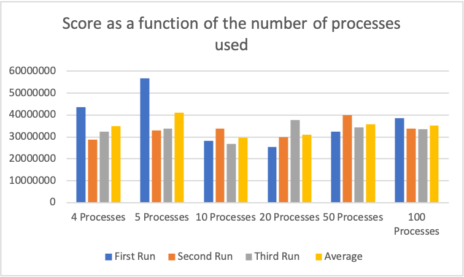

### Group Holycow 955648 - Operating Systems

___________________________________________________________________________

# Final Submission

The following are what is implemented in our final submission to the OS challenge:

- Multithreading with a pool-thread (6 threads)
- Priority Cost function for scheduling tasks
- Multiprocessing
- Hash-tables for caching

##### Hardware Specification

All tests have run on the same computer (using Vagrant). The specifications of the computer is listed below:

| Specification    |     Value     |
|------------------|:-------------:|
| CPU              |   Intel i7    |
| CPU clock speed  |    2.5 GHz    |
| No. of CPU cores |       4       |
| RAM amount       |     16 GB     |
| RAM type         | 1600 MHz DDR3 |
| OS               | macOS 10.14.6 |

Although all tests have been conducted on the same machine there is still the
possibility for errors coming from background OS tasks. The tests were run back-to-back.

# Experiments

## Sequential Model vs Multithread Model

##### Author: Thibaud Bourgeois, s221592

##### Branch: MultiThread-Basic, Thread-Pool

#### Experiment Motivation

This overall experiment seeks to figure out how much (if any) we can benefit from multithreading, i.e. handling
multiple client request simultaneously with threads.
The reason we at all bother to do these experiments is because the computer which are running the test have a multi-core
CPU with 4 cores. Splitting the workload between these 4 cores should result in a speed boost.

It was clear that we needed to use a first parallelization method to drastically improve the performance of our server.
To start, we decided to implement a multi-threaded version of the server.

In this experiment, we want to compare an implementation using only one process (sequential) and an implementation using
multiple threads. The motivation for this experiment is to solve the weakness described above.
The thread model is somehow similar to the process model however threads are more lightweight than processes and thus
changing threads is much faster than changing processes and creating and terminating threads is also much faster.
Furthermore, threads share the same address space as opposite to processes.

The implementation of multithreading has been done in several parts to improve its performance and to make it safe:

###### Pool thread

First of all, we had to limit the number of threads created to limit the use of the CPU. Moreover, an infinite number of
threads does not help anymore at a certain point. This is why the creation of a pool-thread was necessary. It
ensures we don't create an unbounded number of threads.
we used first in first out (FIFO) scheduling to start and wait for threads, i.e. when we had started the maximum number
of threads we called join() on the thread which was first started, and started the new thread when join() returned.

###### Thread-Safe Implementation (Locks and Semaphore)

But even if we got comfortable performances (see results below), we got lucky. There was still a major bug in the code.
The shared data structure we created to stack the connection (the queue) was not thread safe: we were still subject to
race conditions.
Hence, we needed to protect those calls (enqueue() and dequeue()) with the help of a mutex lock.

###### Notes about condition variables and semaphores

At the beginning of the experiment I had added (wrongly) variable conditions to avoid threads doing busy
waiting on the queue while waiting for it to fill up. But in our situation this was not really useful
since when threads freed CPU, they had no one to share it with since they were all in the same waiting situation. This
would have worked if several threads were actually working on a common work.

#### Setup

All tests regarding this experiment has been executed on the same computer,
we have tried to keep the workload constant during the test session,
however this is nearly impossible and background activity could result in errors.
The configuration parameters of the client was the following:

##### Run Configuration

| Setting            |     Value      |
|--------------------|:--------------:|
| SERVER             | 192.168.101.10 |
| PORT               |      5003      |
| SEED               |    3435245     |
| TOTAL              |      100       |
| START              |       0        |
| DIFFICULTY         |    30000000    |
| REP\_PROB\_PERCENT |       20       |
| DELAY_US           |     600000     |
| PRIO_LAMBDA        |      1.50      |

#### Results

Below are the results of the tests:

| Run         |   Sequential   |    Threads     |
|-------------|:--------------:|:--------------:|
| First run   |   95.220.820   |   24.671.300   |
| Second run  |   97.668.541   |   25.518.803   |
| Third run   |   92.979.926   |   24.280.959   |
| **Average** | **95.289.762** | **24.823.687** |

#### Discussion and Conclusion

Looking at the results there is a noticeable difference when comparing the averages, the multi-thread model is clearly
faster that the sequential model.
However, there are still some problem with the thread model.
It starts more threads than we have CPU cores, which result in context switches.
We will now try to fix the problem with having more threads than CPU cores.

## Optimizing Maximum Number Threads

###### Author: Thibaud Bourgeois s221592

###### Branch: MultiThread-Basic, Thread-Pool

In this experiment we want to address the problem with having more threads than CPU cores, the reason that this is a
problem is, that if we start more threads than we have cores, the scheduler have to do context (thread) switches (which
takes time even if thread switching is very efficient and much cheaper than process switching. The motivation is to
avoid making these context switches. This should be as simple as setting the number of threads equal to the number of
cores, however we will try some different number of threads to see which number actually give us the best performance.

##### Run Configuration

| Setting            |     Value      |
|--------------------|:--------------:|
| SERVER             | 192.168.101.10 |
| PORT               |      5003      |
| SEED               |    3435245     |
| TOTAL              |      100       |
| START              |       0        |
| DIFFICULTY         |    30000000    |
| REP\_PROB\_PERCENT |       20       |
| DELAY_US           |     600000     |
| PRIO_LAMBDA        |      1.50      |

#### Results

We did the experiment by changing the maximum number of threads to 3, 4, 5, 6, 7, 8 and 20. The result can be found in
the table below. The listed number of threads is only how many threads that are actively calculating client requests, in
addition to those there are also the main thread which is managing the threads as well as setting up the server
initially.

| Run         | 3 Threads      | 4 Threads      | 5 Threads      | 6 Threads      | 7 Threads      | 8 Threads      | 20 Threads     |
|-------------|----------------|----------------|----------------|----------------|----------------|----------------|----------------|
| First Run   | 29.801.572     | 24.671.300     | 20.899.400     | 19.063.160     | 20.425.256     | 21.532.380     | 23.463.315     |
| Second Run  | 29.603.170     | 25.518.803     | 21.005.840     | 23.730.163     | 20.681.164     | 21.664.842     | 22.048.472     |
| Third Run   | 28.995.181     | 24.280.959     | 20.995.528     | 20.129.427     | 22.083.564     | 21.868.455     | 22.498.278     |
| **Average** | **29.464.635** | **24.818.339** | **20.966.867** | **20.882.172** | **21.050.894** | **21.688.119** | **22.662.390** |

Below is a graphical representation of the results:

#### Discussion and Conclusion

Looking at the graph the best number of threads seems to be 6. We initially expected that the best number would be
3 (4 including the main thread) because this would match the number of cores, and thereby we would avoid making
expensive context switches.
However, a valid point is that 5 (6 including the main thread) could result in a better performance, because the main
thread is idle most of the time, so it could be worth to switch between the main thread and a thread handling client
request. The reason that 6 is the best is more difficult to answer, a guess could be that it is better to start more
threads because of the FIFO problem described in the "Process Model vs Thread Model" experiment (Idle threads if the
first one takes a lot of time).

## Scheduling Threads with a Priority-based Cost Function

###### Author: Thibaud Bourgeois, s221592

###### Branch: Priority-Queue

In this experiment, the goal is to optimize the score by choosing tasks based on their priority.
At first, we will sort the tasks with the priority value, and then with: (priority)/(end - start)

Elements are put into a priority queue, implemented as a linked list. Worker threads then draw from this queue,
taking the higher value computations first, and run them to completion. For these tests, I set the number of
threads in the worker pool-thread to be 6.

##### Run Configuration

| Setting            |     Value      |
|--------------------|:--------------:|
| SERVER             | 192.168.101.10 |
| PORT               |      5003      |
| SEED               |    3435245     |
| TOTAL              |      100       |
| START              |       0        |
| DIFFICULTY         |    30000000    |
| REP\_PROB\_PERCENT |       20       |
| DELAY_US           |     600000     |
| PRIO_LAMBDA        |      1.50      |

#### Results

| Run        | FIFO     | Priority-Queue sorted by taking into account p | Priority-Queue sorted by taking into account start, end and p |
|------------|----------|------------------------------------------------|---------------------------------------------------------------|
| First Run  | 19063160 | 18648245                                       | 17955248                                                      |
| Second Run | 23730163 | 19413889                                       | 17968412                                                      |
| Third Run  | 20129427 | 18515116                                       | 18045548                                                      |
| Average    | 20882172 | 18854961.44                                    | 17989691.95                                                   |

Below is a graphical representation of the results:

Using the 6 threads pool-thread, we achieve a noticeably better score than the FIFO.
Moreover, taking into account the distance between the start and the end also allows to gain slightly in performance.

#### Discussion

Due to the structure of the priority queue - a linked-list - this code is most efficient when the requests are coming
at approximately the speed they can be solved or slower. If requests come too fast, then each request needs to be
inserted into the linked list individually, leading to O(n^2) performance of insertion sort. This overhead bogs down the
main thread and might interfere with network receive operations.

#### Conclusion

This result of this experiment is as expected - a more intelligent scheduling algorithm
outperforms a simple FIFO.

## Multiprocess Model vs Multithread Model

##### Author: Ghalia Bennani, s221649

##### Branch: Multiprocess-Basic

#### Experiment Motivation

The aim of this experiment is to test another type of parallelization. Indeed, we want to compare the concurrent
implementations using multiples threads and multiple processes. Even if we believe that the multiprocess version will 
be slower than the multi-threads one, we want to give it a try. Of course, in this experiment, we keep exactly the same
configuration as the last kept version (priority queue...). We only replacing the multithreading by multiprocessing.

The process model works that way: every time the server receives a client request a new process is created using the 
fork system call. We need to choose wisely the number of processes that can live simultaneously, in our case it is four
since the computer which is running the test have a multi-core CPU with 4 cores. This way there is no shared memory 
(critical sections) and thus no need for synchronisation. If we want to increase the number of processes we will need
to protect the critical sections. We will see later what is the optimal choice.

## Optimizing the number of processes
In this section we seek to find the optimal number of processes.

#### Setup

All tests regarding this experiment has been executed on the same computer,
we have tried to keep the workload constant during the test session,
however this is nearly impossible and background activity could result in errors.
The configuration parameters of the client was the following:

##### Run Configuration

| Setting            |     Value      |
|--------------------|:--------------:|
| SERVER             | 192.168.101.10 |
| PORT               |      5003      |
| SEED               |    3435245     |
| TOTAL              |      100       |
| START              |       0        |
| DIFFICULTY         |    30000000    |
| REP\_PROB\_PERCENT |       20       |
| DELAY_US           |     600000     |
| PRIO_LAMBDA        |      1.50      |

#### Results

Below are the results of the tests:
Note that when the number of processes exceeds 4, some security of the critical region have been implemented.

| Run         | 4 Processes    | 5 Processes    | 10 Processes   | 20 Processes   | 50 Processes   | 100 Processes  | 
|-------------|----------------|----------------|----------------|----------------|----------------|----------------|
| First Run   | 43.490.995     | 56.853.092     | 28.273.468     | 25.301.062     | 32.465.741     | 38.502.073     | 
| Second Run  | 28.869.131     | 32.835.505     | 33.762.657     | 29.910.688     | 39.938.347     | 33.823.337     | 
| Third Run   | 32.406.480     | 33.714.794     | 26.862.934     | 37.785.497     | 34.472.936     | 33.482.823     | 
| **Average** | **34.922.202** | **41.134.463** | **29.633.019** | **30.999.082** | **35.625.674** | **35.269.411** | 

Below is a graphical representation of the results:

#### Discussion and Conclusion

Looking at the graph the best number of processes seems to be between 10 and 20. We initially expected that the best number would be
3 (4 including the parent process) because this would match the number of cores.

## Comparison between multithreading and multiprocessing
In this section we compare the two parallelization techniques. Indeed, we run both models three times with their 
respective optimal number of threads/processes.

#### Setup

All tests regarding this experiment has been executed on the same computer,
we have tried to keep the workload constant during the test session,
however this is nearly impossible and background activity could result in errors.
The configuration parameters of the client was the following:

##### Run Configuration

| Setting            |     Value      |
|--------------------|:--------------:|
| SERVER             | 192.168.101.10 |
| PORT               |      5003      |
| SEED               |    3435245     |
| TOTAL              |      100       |
| START              |       0        |
| DIFFICULTY         |    30000000    |
| REP\_PROB\_PERCENT |       20       |
| DELAY_US           |     600000     |
| PRIO_LAMBDA        |      1.50      |

#### Results

Below are the results of the tests:
Note that we used 6 threads and 10 processes.

| Run         |   Processes    |    Threads     |
|-------------|:--------------:|:--------------:|
| First run   |   28.273.468   |   18.689.768   |
| Second run  |   33.762.657   |   23.543.790   |
| Third run   |   26.862.934   |   20.635.433   |
| **Average** | **29.633.019** | **20.956.330** |

Below is a graphical representation of the results:

#### Discussion and Conclusion

Looking at the result there is a noticeable difference when comparing the averages, the thread model is approximately 
1.5 times faster than the process model. That was expected since threads are more lightweight than processes and thus
changing threads is much faster than changing processes and creating and terminating threads is also much faster.
Furthermore, threads share the same address space as opposite to processes. Therefore, we won't keep the multiprocess
option in the final configuration.

## Caching the requests

##### Author: Ons Riahi, s221565

##### Branch: hashTables

#### Experiment Motivation

Repetition of taks or events is something common in our daily lives. For example, accessing DTU web page multiple times during the same day. For this purpose, web caching was invented, it’s the activity of storing data for reuse, such as a copy of a web page served by a web server. It’s cached or stored the first time a user visits the page and the next time a user requests the same page, a cache will serve the copy, which helps keep the origin server from getting overloaded as well as it enhances page delivery speed significantly and reduce the work needed to be done by the server.
It’s crystal clear to see the analogy between the given example and the fact that a server in our OS-Challenge can receive a duplicate of a previously sent request. So, a way to avoid computing the same reverse hashing, is to save or cache the previous hashes and their original values. So, whenever a request is repeated, there is no need to waste time on decoding, we can extract the right answer faster.
In practice, we can use several data structures for caching but in our project, we implemented a hash table which is known to be more efficient than other data structures since the insert and search operations have a time complexity O(1).
So, the idea was to implement an array of structs containing both the hash and its corresponding value. We also used closed hashing which is a method of collision resolution that consists in searching through alternative locations in the array until either the target record is found or an unused array slot is found, which indicates that there is no such key in the table.
(The key here is going to be the hash).

#### Setup 
All tests regarding this experiment has been executed on the same machine.

##### Run Configuration

| Setting            |     Value      |
|--------------------|:--------------:|
| SERVER             | 192.168.101.10 |
| PORT               |      5003      |
| SEED               |    3435245     |
| TOTAL              |      100       |
| START              |       0        |
| DIFFICULTY         |    30000000    |
| REP\_PROB\_PERCENT |       20       |
| DELAY_US           |     600000     |
| PRIO_LAMBDA        |      1.50      |

#### Results

Below are the results of the tests:

| Run         |   Sequential without hash table   |    Sequential with hash table     |
|-------------|:---------------------------------:|:---------------------------------:|
| First run   |            95.220.820             |            71.792.487             |
| Second run  |            97.668.541             |            72.894.615             |
| Third run   |            92.979.926             |            70.524.722             |
| **Average** |          **95.289.762**           |          **71.737.275**           |

Below is a graphical representation of the results :

#### Discussion and conclusion :

We can see that using a hashtable is faster than reverse hashing whenever we receive a request. Although, the difference is not so large since the repetition probability is only 20% but it is still better than using the simple sequential model.
NB : below we increased the repetition probability, the results are better as expected .

| Run         |    repetition probability 20%     |    repetition probability 50%     |
|-------------|:---------------------------------:|:---------------------------------:|
| First run   |            71.792.487             |            41.191.500             |
| Second run  |            72.894.615             |            43.275.962             |
| Third run   |            70.524.722             |            40.760.749             |
| **Average** |          **71.737.275**           |          **41.742.737**           |

And this graph is a representation of the results :

## Multi-threading and Caching

##### Author: Ons Riahi, s221565

##### Branch: Final-Version

#### Experiment Motivation

As we saw previously, both multi-threading and caching have a good impact on the server’s performance since these two experiments are efficient and makes the server faster when it comes to answering the client’s requests.
That’s why we decided to combine these two features for our final version of OS-Challenge.

The hash table being used by multiple threads at the same time has a need for some kind of synchronization. The latter has to guarantee consistency of the hash table with parallel inserts, updates and queries on the data. To do so, we will use locks.

##### Run Configuration

| Setting            |     Value      |
|--------------------|:--------------:|
| SERVER             | 192.168.101.10 |
| PORT               |      5003      |
| SEED               |    3435245     |
| TOTAL              |      100       |
| START              |       0        |
| DIFFICULTY         |    30000000    |
| REP\_PROB\_PERCENT |       20       |
| DELAY_US           |     600000     |
| PRIO_LAMBDA        |      1.50      |

#### Results

Below are the results of the tests:

| Run         |   Sequential   |    Multi-threading without hash table     |     Multi-threading with hash table    |
|-------------|:--------------:|:-----------------------------------------:|:---------------------------------------:
| First run   |   95.220.820   |                 18.689.768                |               18.958.127               |
| Second run  |   97.668.541   |                 23.543.790                |               17.198.736               |
| Third run   |   92.979.926   |                 20.635.433                |               17.763.928               |
| **Average** | **95.289.762** |               **20.956.330**              |             **17.973.597**             |

Below is a graphical representation of the results :

#### Discussion and conclusion :

The results show that a performance boost can be achieved by combining multi-threading and caching. Although this improvement seems to be slight since the repetition probability is not high but we still cannot ignore it.
We tried to test with a repetition probability of 50% and these are the results :

| Run         |    repetition probability 20%     |    repetition probability 50%     |
|-------------|:---------------------------------:|:---------------------------------:|
| First run   |            18.958.127             |            ??.???.???             |
| Second run  |            17.198.736             |            ??.???.???             |
| Third run   |            17.763.928             |            ??.???.???             |
| **Average** |          **17.973.597**           |          **??.???.???**           |

And the corresponding graphical representation :

